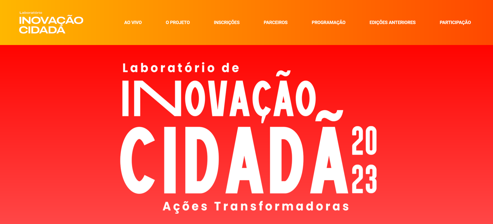

# 💡 LABIC Landing Page

Uma "landing page" do Laboratório de Inovação Cidadã da UFRJ. 

## 📚 Tabela de Conteúdos

- [💡 LABIC Landing Page](#-labic-landing-page)
  - [📚 Tabela de Conteúdos](#-tabela-de-conteúdos)
  - [📋 Descrição](#-descrição)
    - [🚀 Funcionalidades](#-funcionalidades)
    - [🌐 Acesso](#-acesso)
    - [📸 Prévia](#-prévia)
  - [⚙️ Construção](#️-construção)
    - [💻 Tecnologias](#-tecnologias)
    - [🛠️ Ferramentas](#️-ferramentas)
    - [📌 Versão](#-versão)
  - [✒️ Autores](#️-autores)
  - [🎁 Agradecimentos](#-agradecimentos)
  - [📨 Contato](#-contato)

## 📋 Descrição

Este é o projeto da página de divulgação do Laboratório de Inovação Cidadã da UFRJ.

O Laboratório de Inovação Cidadã da UFRJ é uma rede de ações, pesquisa, e formação com objetivo de mapear e sistematizar experiências de referência em tecnologias sociais e inovação no Estado do Rio de Janeiro. São espaços criados para desenvolver, apoiar e acelerar essas propostas que surgem e têm potencial para serem replicadas ou ativar outras ações, pesquisas e iniciativas.

É O "MATCH DA INOVAÇÃO"

porque aproxima projetos e experiências da cidade com quem pode ajudar a concretizá-lo ou melhorá-los.

A iniciativa é realizada pelo Pontão de Cultura Digital da Escola de Comunicação da UFRJ, coordenado pela professora Ivana Bentes desde 2017. As edições anteriores são: Rio de Janeiro 2017,2018,2019 e edições em Salvador 2019 e Lisboa 2019. Desde 2020 realizamos edições virtuais.

O Laboratório de Inovação Cidadã conta com o apoio da Bolsa Cientista do Nosso Estado da FAPERJ e CNPQ.

### 🚀 Funcionalidades

As funcionalidades disponíveis para os usuários estão listadas abaixo:

- Conhecer o LABIC UFRJ pela sua história, ações e projetos
- Conferir as gravações das mentorias das edições do LABIC
- Entender o papel da Inovação Cidadã na sociedade

### 🌐 Acesso

🖇️ [Clique aqui para acessar o projeto](https://pontao-da-eco.github.io/labic-landing-page/)

### 📸 Prévia

  

## ⚙️ Construção

Resumo geral dos recursos utilizados na construção do projeto.

### 💻 Tecnologias

Tecnologias utilizadas na construção do projeto:

### 🛠️ Ferramentas

Ferramentas utilizadas na construção do projeto:

### 📌 Versão

Utilizei o Git para o controle de versão. 

Versão atual: 1.0 (primeira versão)

## ✒️ Autores

* **Milton Salgado Leandro** - *Codificação e Montagem da Página* - [GitHub](https://github.com/milton-salgado)
* **Louise Guima** - *Disponibilização e Organização das Mídias e do Conteúdo da Página* - [Instagram](https://www.instagram.com/louiseguima/)
* **Mylena Larrubia** - *Disponibilização e Organização das Mídias e do Conteúdo da Página* - [Instagram](https://www.instagram.com/mylenalarrubia/)

## 🎁 Agradecimentos

* Agradeço ao desenvolvedor Saulo Roberto pela recomendação e apoio no desenvolvimento no projeo e à equipe do Pontão da ECO pela disponibilização das mídias e conteúdos para o site.
* Agradeço também a você, visitante, por visualizar o meu projeto!

## 📨 Contato

